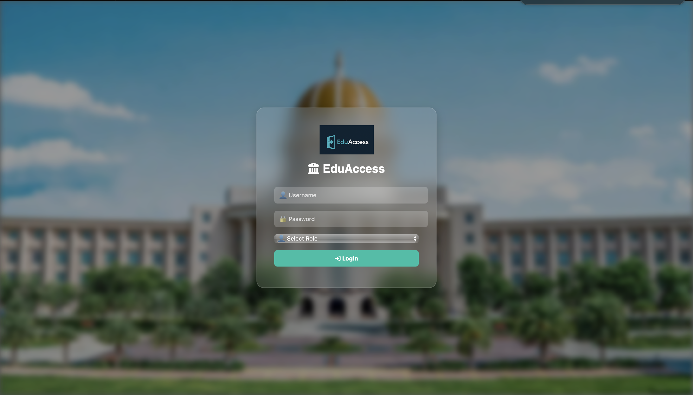
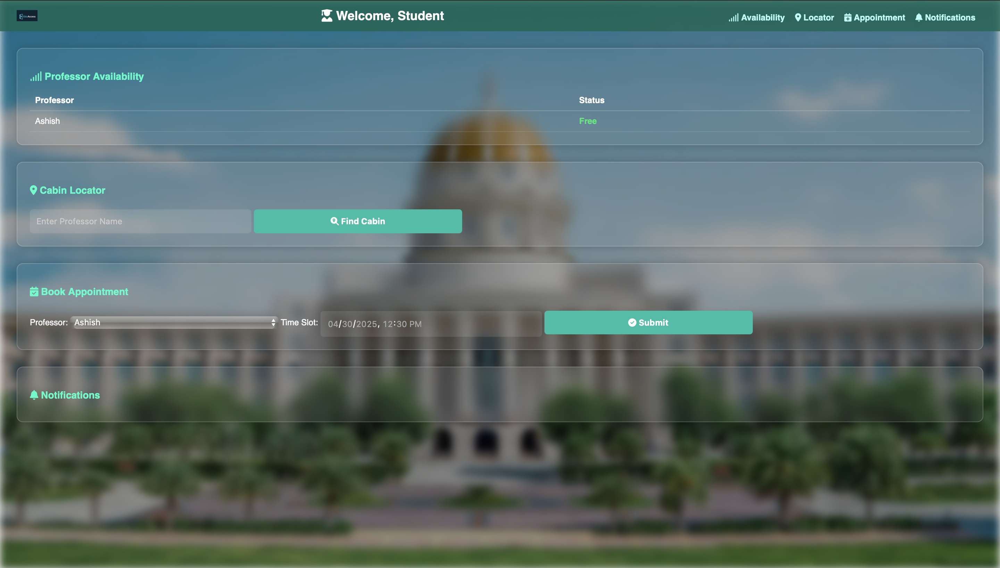
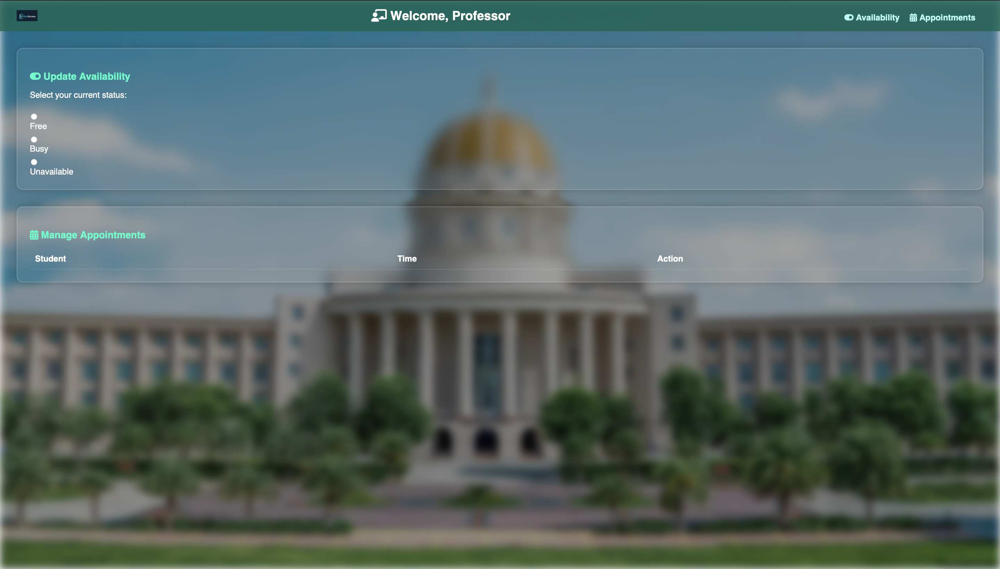

# 📘 EduAccess: Faculty Availability & Cabin Locator System

EduAccess is a full-stack web platform designed to streamline faculty-student interactions in university campuses. It enables real-time professor availability updates, cabin location lookup, and appointment booking based on roles (Student/Professor).

---

## 🚀 Features

- 🔐 **Role-Based Login**: Students and Professors access distinct dashboards.
- 👨‍🏫 **Professor Dashboard**:  
  - Update availability status (Free, Busy, Unavailable)  
  - View and manage appointment requests
- 🎓 **Student Dashboard**:  
  - Check real-time professor availability  
  - Book appointments by selecting date & time  
  - Search professor cabin locations
- 🔔 **Notifications**: Students receive confirmations for appointments.
- ♻️ **Auto Refresh**: Dashboards auto-update availability every 10 seconds.
- 🎨 **Responsive UI**: Clean, modern interface with background blur, animations, and dropdown interactions.

---

## 🛠️ Tech Stack

| Layer        | Technology                     |
|--------------|--------------------------------|
| Frontend     | HTML, CSS, JavaScript (Vanilla) |
| Backend      | Django, Django REST Framework  |
| Database     | PostgreSQL                     |
| Real-time    | JavaScript polling (setInterval) |
| Deployment   | (Planned) Docker + Heroku/Render |

---

## 📁 Project Structure

```bash
EduAccess/
├── api/                     # Django App
│   ├── models.py            # User, Appointment, Notification
│   ├── views.py             # REST APIs
│   ├── serializers.py
│   ├── urls.py
├── eduaccess_backend/      # Django Project settings
├── frontend/
│   ├── templates/           # HTML Files (index, student-dashboard, professor-dashboard)
│   ├── static/
│   │   ├── js/script.js     # Frontend logic & AJAX
│   │   ├── css/styles.css   # Custom styling
│   │   └── assets/          # Logo and background images
├── manage.py
├── README.md                # This file
```

---

## 🧪 Local Setup

1. **Clone the repository**
   ```bash
   git clone https://github.com/your-username/EduAccess.git
   cd EduAccess
   ```

2. **Create a virtual environment**
   ```bash
   python3 -m venv eduaccess-env
   source eduaccess-env/bin/activate
   ```

3. **Install dependencies**
   ```bash
   pip install -r requirements.txt
   ```

4. **Configure PostgreSQL and `.env` (if applicable)**

5. **Run the server**
   ```bash
   python manage.py makemigrations
   python manage.py migrate
   python manage.py runserver
   ```

6. **Access in Browser**
   - Student Dashboard: `http://127.0.0.1:8000/student/`
   - Professor Dashboard: `http://127.0.0.1:8000/professor/`
   - Admin Panel: `http://127.0.0.1:8000/admin/`

---

## 📷 Screenshots

| Login | Student Dashboard | Professor Dashboard |
|-------|-------------------|---------------------|
|  |  |  |

---

## 🙌 Contributors

- [Mohini](https://github.com/Mohini-vashisth) – Full Stack Developer

---

## 📄 License

This project is open-source and available under the [MIT License](LICENSE).
